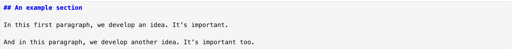
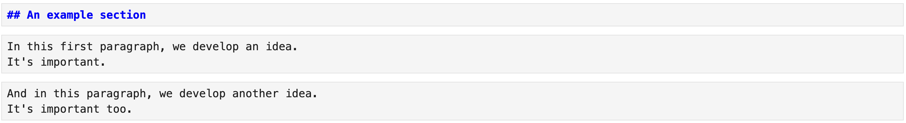

# How to contribute to the tutorials?

This document describes how to contribute to the tutorials.
It also contains guidelines about how to format the notebooks.

We assume you have a basic knowledge of `git` and GitHub.
If it's not the case, read the [GitHub tutorials](https://docs.github.com/en/get-started).

We also assume basic familiarity with Jupyter notebooks.
If it's not the case, read [this introduction](https://jupyter.org/try-jupyter/notebooks/?path=notebooks/Intro.ipynb).

## Contribution workflow

### Basic workflow

The workflow to contribute is based on GitHub.

The first thing to do if you want to improve the tutorials is to open an issue on GitHub to describe your idea.
An issue can be about anything from a simple typo to larger improvements.
This issue will be used to discuss the best way to tackle the problem.

If you want to work on this issue, you will have to fork the repository in your GitHub account,
create a branch and open a pull request once the modification is done.

### CI rules

The GitHub repository contains CI rules to ensure that some quality criteria are met before merging a PR.

Here is a short description of the rules:

- ensure that the code in the notebook runs
- ensure that cells are run in order
- ensure that notebooks don't install packages that are not in the conda environment
- ensure that there is no spelling mistakes in the files

## Notebook formatting

The format of Jupyter notebooks is hard to version properly.
To ease reviews and merges, it's important that notebooks are written in a consistent way.
Here are some indications.

### Markdown formatting

Notebook for tutorials often contains explanatory text in addition to code.
When writing text always split different titles and paragraphs in different cells.
Also, use a newline for each sentence (Markdown is insensitive to this).

For instance, don't do:



Instead, do:



The rendering is close but this helps when comparing versions.

### Store images in the img/ folder

If you want to include an image, store it in the folder `img/`.

### Use relative links for images and other notebooks

To insert links to an image or to another notebook in this repository,
use a relative link without any URL.

For instance, to add a link to a notebook, don't do:

```
See [this notebook](https://github.com/gwosc-tutorial/introduction_gwosc_data/My New Notebook.ipynb).
```

Instead, do:

```
See [this notebook](<./My New Notebook.ipynb>).
```

### Notes and warnings

To insert a note, use the following snippet:

```html
<div class="alert alert-block alert-info">
<div><b>&#x2139; Note</b></div>
    Your note.
</div>
```

To insert a warning, use the following snippet:

```html
<div class="alert alert-block alert-warning">
<div><b>&#9888; Warning</b></div>
    Your alert.
</div>
```

Such admonition should go in a separate cell.

## Other guidelines

### Re-run the notebook from scratch before committing

Before committing, it's good to re-run the notebook from scratch
as it allows to ensure that there is no bug
and to have nicely ordered cells.
As explained above the CI rules enforce this so get used to this,
it will help when opening the PR.

To do so, open the "Run" menu and click "Restart Kernel and Run All Cells".

### Specific code for Google Colab

Google Colab is a service used to run notebooks in the browser without installation.
It is important to test your modifications on Google Colab.

However, the service has 2 technical limitations:

  - The notebooks are run in isolation.
    So if your modification needs the output from another notebook (such as a downloaded file, etc.)
    you have to provide a way to access it.
  - Only basic packages are installed.
    Therefore, your notebook should include calls to `pip` to install any additional packages.

This specific code should be placed in a dedicated cell near the top of the notebook
and commented out by default.
Also, add a warning before such cells.
Have look at [tutorial 5](<./05 - GWpy Examples.ipynb>) for an example.

### `git` pre-commit hook

The CI rules described above are based on scripts that stored in this repository.
For advanced users, we recommend you use those scripts as `git` pre-commit hook
so you will minimize surprises during the PR.
Find below an example:

```bash
#!/usr/bin/env bash
#
# An example hook script to verify what is about to be committed.
# Called by "git commit" with no arguments.  The hook should
# exit with non-zero status after issuing an appropriate message if
# it wants to stop the commit.
#
# The script is run at the root of the repository

#set -x

set -e
set -u
set -o pipefail

# This is used to determine against what to compare:
# if the repository is not empty, it's HEAD
# otherwise against the hash of an empty directory
if git rev-parse --verify HEAD >/dev/null 2>&1
then
	against=HEAD
else
	# Initial commit: diff against an empty tree object
	against=$(git hash-object -t tree /dev/null)
fi

# Redirect output to stderr.
exec 1>&2

# Get the list of modified files
# We want all modified files except the delete ones (hence --diff-filter=d)
declare -a modified_files
OLD_IFS="${IFS}"
IFS=$'\n'
modified_files=( $(git diff --cached --name-only -z --diff-filter=d $against | tr '\0' '\n') )
IFS="${OLD_IFS}"

if [[ "${#modified_files}" -eq 0 ]]
then
    echo "Nothing to check"
    exit 0
fi

echo "Gonna check ${#modified_files[@]} file(s): ${modified_files[@]}"

echo "Checking modified files"
for modified_file in "${modified_files[@]}"
do
    if [[ "${modified_file}" =~ \.ipynb$ ]]
    then
        echo "Checking notebook ${modified_file}"
        ./tests/check_run.sh "${modified_file}"
        ./tests/check_spelling.sh "${modified_file}"
        ./tests/check_versions.py "${modified_file}"
        ./tests/check_execution_order.py "${modified_file}"
    else
        echo "Checking non-notebook ${modified_file}"
        # Spell check other files
        codespell -I .dictionary.txt --skip="*.ipynb" "${modified_file}"
    fi
done
```
